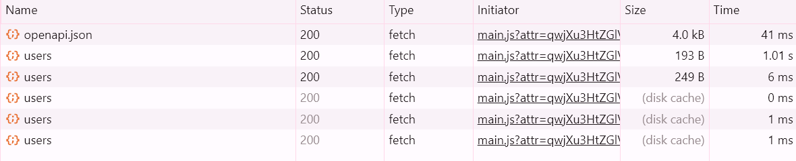

# Общий README для всего проекта 
## Схемы drawio пронумерованы по названиям в корне проекта.
## В каждой папке есть свой README. Но тут с полной информацией.


## Как запустить

Запускаем mongodb и приложение

```shell
docker compose up 
```

## Далее выполняем следующие команды для конфигурации и сохранения данных

### Инициализация конфигурации:
docker exec -it configSrv mongosh --port 27017

rs.initiate(
  {
    _id : "config_server",
    configsvr: true,
    members: [
      { _id: 0, host : "configSrv:27017" },
      { _id: 1, host : "configSrv_replica:27017" },
      { _id: 2, host : "configSrv_replica_replica:27017" }
    ]
  }
);

exit()

### Инициализация 1 шарда:
docker exec -it shard1 mongosh --port 27018

rs.initiate(
    {
      _id : "shard1",
      members: [
        { _id: 0, host : "shard1:27018" },
        { _id: 1, host: "shard1_replica:27018" },
        { _id: 2, host: "shard1_replica_replica:27018" }
      ]
    }
);

exit()

### Инициализация 2 шарда:
docker exec -it shard2 mongosh --port 27019

rs.initiate(
    {
      _id : "shard2",
      members: [
        { _id : 0, host : "shard2:27019" },
        { _id : 1, host : "shard2_replica:27019" },
        { _id : 2, host : "shard2_replica_replica:27019" }
      ]
    }
  );

exit()


### Инициализация шардов и наполнение данными
docker exec -it mongos_router mongosh --port 27020

sh.addShard("shard1/shard1:27018,shard1_replica:27018,shard1_replica_replica:27018")

sh.addShard("shard2/shard2:27019,shard2_replica:27019,shard2_replica_replica:27019")

sh.enableSharding("somedb");

sh.shardCollection("somedb.helloDoc", { "name" : "hashed" } )

use somedb;

for(var i = 0; i < 1000; i++) db.helloDoc.insert({age:i, name:"ly"+i})

db.helloDoc.countDocuments() 

### Посмотреть шарды и реплики
sh.status()   
### Посмотреть кол-во данных в каждом шарде
db.helloDoc.getShardDistribution()
### Приведу результат, который у меня получился:
[direct: mongos] somedb> db.helloDoc.getShardDistribution()

Shard shard2 at shard2/shard2:27019,shard2_replica:27019,shard2_replica_replica:27019

{
  data: '23KiB',
  docs: 508,
  chunks: 2,
  'estimated data per chunk': '11KiB',
  'estimated docs per chunk': 254
}

---
Shard shard1 at shard1/shard1:27018,shard1_replica:27018,shard1_replica_replica:27018
{
  data: '22KiB',
  docs: 492,
  chunks: 2,
  'estimated data per chunk': '11KiB',
  'estimated docs per chunk': 246
}
---
Totals
{
  data: '45KiB',
  docs: 1000,
  chunks: 4,
  'Shard shard2': [
    '50.82 % data',
    '50.8 % docs in cluster',
    '46B avg obj size on shard'
  ],
  'Shard shard1': [
    '49.17 % data',
    '49.2 % docs in cluster',
    '46B avg obj size on shard'
  ]
}

## Скриншот из свагера. Видно, что запрос закешировался.

